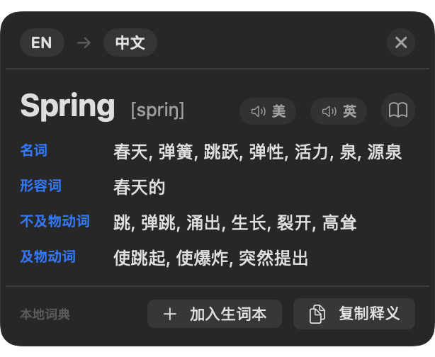
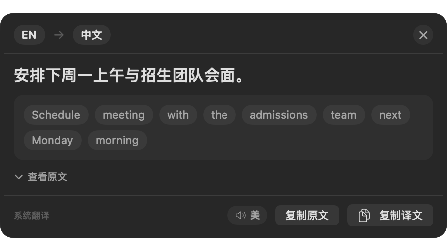

# 扇形翻译 · Fan Translation

> 一个极简的 macOS 菜单栏截图翻译工具 —— 框选屏幕上的英文，立刻得到中文翻译、词典释义与真人级发音。


**话题**：`macOS` `Swift` `截图翻译` `OCR` `词典` `离线优先` `菜单栏工具`

## 📸 效果预览

**查单词**（自动进入词典模式，多词性多释义 + 发音）



**翻句子**（整句翻译，单词可点选加入生词本）



## ✨ 特性

| 功能 | 说明 |
| --- | --- |
| 🔤 **截图翻译** | 全局快捷键框选屏幕任意区域，自动识别英文并翻译成中文 |
| 📖 **词典模式** | 识别到单个英文单词时，自动查本地词典，按**名词 / 动词 / 形容词**等词性分组展示多个义项 |
| 🔊 **真人级发音** | 内置系统语音合成，**美音 / 英音**一键切换，完全离线 |
| 📚 **生词本** | 点单词即可收藏，随时查看、导出（逗号分隔）、清空 |
| 🌍 **多语言** | 支持 10 种源语言与目标语言互译 |
| 🖱️ **自由拖动** | 结果面板可拖动到任意位置，宽度按内容自适应 |
| 🔒 **隐私优先** | 识别、查词、发音**全部在本机完成**，不上传任何内容 |
| ⚡ **完全离线** | 词典（4.4 万词）与发音引擎都内置，断网也能用 |

## 📦 安装

### 方式一：下载安装包（推荐）

1. 从 [Releases](../../releases) 下载 `截图翻译-Apple芯片-v1.0.dmg`
2. 双击打开，把「截图翻译.app」拖进「应用程序」文件夹
3. 首次打开若提示"无法验证开发者"，**右键点 App → 打开 → 再点打开**（或在终端执行 `xattr -cr /Applications/截图翻译.app`）

### 方式二：从源码构建

```bash
git clone https://github.com/kirin3088-dot/Fan-Translation.git
cd Fan-Translation
./build.sh          # 一键编译 + 打包 + 签名，产出 SnapTranslate.app
open SnapTranslate.app
```

> 构建需要 Xcode 命令行工具（`xcrun`），无需 Xcode 完整版，也无需任何第三方依赖。

## 🚀 使用

| 操作 | 说明 |
| --- | --- |
| **`Command + S`** | 呼出截图框选，框住想翻译的英文 |
| 点单词标签 | 把不认识的单词加入生词本（再次点击取消） |
| 🔊 美 / 🔊 英 | 用美式 / 英式发音朗读单词 |
| 📖 | 在 Mac 自带「词典」App 中打开完整词条 |
| `Esc` / 点击别处 | 关闭结果面板 |

菜单栏图标（Fan 图标）里还可以：

- **修改快捷键**（预设 6 种，也支持自定义录制）
- **切换源语言 / 目标语言**（10 种语言）
- **打开生词本**（查看、删除、复制全部、清空）
- **翻译剪贴板里的截图**
- **检查屏幕截图权限** / **检查翻译语言包**

## 📁 项目结构

```
Fan-Translation/
├── main.swift             # 全部应用逻辑（单文件，约 1700 行）
├── build.sh               # 一键构建脚本（编译 → 打包 → 生成图标 → 内置词典 → 签名）
├── Info.plist             # App 配置（菜单栏常驻、无 Dock 图标）
├── render_icon.swift      # 图标生成脚本（CoreGraphics 绘制 → icns）
├── dict.db                # 内置英汉词典（4.4 万常用词，8.9MB）
├── icon.icns              # 应用图标
├── scripts/
│   └── build_dict.sh      # 词典数据库生成脚本（从开源词典精简而来）
└── 安装说明.txt
```

## 🔧 技术细节

整体是一个**零依赖的单文件 Swift 应用**，只用系统自带框架：

| 模块 | 实现 |
| --- | --- |
| 屏幕截图 | `screencapture` 命令行（`-i` 交互式框选） |
| 文字识别 | **Vision** `VNRecognizeTextRequest`（本机 OCR，识别语言跟随源语言设置） |
| 整句翻译 | macOS 15+ 走系统 **Translation** framework（弱链接，老系统自动回退） |
| 兜底翻译 | MyMemory 在线接口（系统翻译不可用时） |
| 单词词典 | 内置 **SQLite** 数据库（离线查询，毫秒响应） |
| 发音朗读 | **AVFoundation** `AVSpeechSynthesizer`（系统语音，离线） |
| 全局热键 | Carbon `RegisterEventHotKey` |
| 界面 | SwiftUI + `NSPanel` 浮窗 |

### 几个值得说明的设计

- **词典为什么是本地的？** 苹果在新版 macOS 已把 `DictionaryServices` 框架掏空（导出符号为 0），无法再编程调用系统词典。因此改为内置开源词典数据，换来的是**离线可用 + 覆盖 4.4 万词 + 毫秒响应**。面板里仍保留「📖」按钮，可用 `dict://` 唤起 Mac 自带词典查看完整词条。
- **窗口拖动**：使用系统原生的 `isMovableByWindowBackground`，避免手写 `mouseDragged` 导致的重绘卡顿与闪烁。
- **面板圆角**：直接用「圆角形状 + 材质填充」，而非「矩形材质 + clipShape 裁剪」—— 后者会在圆角外残留直角边。
- **快捷键冲突**：菜单项若设置 `keyEquivalent` 会与 Carbon 热键抢注册，因此快捷键改用 `attributedTitle` 显示，不参与全局注册。

## ❓ 常见问题

<details>
<summary><b>每次更新后都要重新授权屏幕录制权限？</b></summary>

是的。本工具用自签名证书签名（非 Apple 付费开发者账号），而 macOS 的屏幕录制权限绑定在代码签名指纹上。**只要代码一变，授权就失效**，这是自签名方案的固有限制。

更新后重新授权一次即可：

```bash
tccutil reset ScreenCapture com.local.snaptranslate
```

然后按快捷键 → 弹窗点「允许」→ 工具自动重启 → 生效。

> 想彻底告别此问题，需购买 Apple Developer ID（¥688/年）签名。
</details>

<details>
<summary><b>为什么 Option + S 按了没反应？</b></summary>

中文输入法（如微信输入法、搜狗）会**截留 Option + 字母键**，优先级高于第三方软件的热键。

解决办法：改用 `Command + S`（本工具默认值），或在菜单栏里换一个组合。
</details>

<details>
<summary><b>提示"暂时没翻译出来"？</b></summary>

优先走系统翻译（macOS 15+，离线）。若系统翻译语言包未下载，会回退到在线翻译（需要联网）。可在菜单栏点「检查并下载翻译语言包」，或在**系统设置 → 通用 → 语言与地区 → 翻译语言**里开启对应语言。
</details>

<details>
<summary><b>词典里查不到某个词？</b></summary>

内置词典是**前 5 万高频词 + 柯林斯/牛津核心词**（共 43,823 条），覆盖日常阅读的绝大多数词汇，但不包含生僻词。查不到时会自动回退到普通翻译模式。

你也可以按 `scripts/build_dict.sh` 重新生成一份更大的词典。
</details>

## 🛠 重新生成词典数据库

内置的 `dict.db` 由开源词典精简而来，如需生成更大词库：

```bash
./scripts/build_dict.sh       # 下载开源词典 → 精简 → 输出 dict.db
```

脚本会自动下载原始数据（约 200MB）、按词频筛选出常用词、建立索引并压缩，最终产出约 9MB 的数据库。

## 🙏 致谢

- 词典数据源：[**ECDICT**](https://github.com/skywind3000/ECDICT) —— 开源英汉词典数据库（77 万词条）
- 翻译能力：Apple 系统 **Translation** framework 与 **Vision** OCR
- 发音引擎：macOS 系统内置语音

## 👤 作者

[@kirin3088-dot](https://github.com/kirin3088-dot)

欢迎提交 Issue 和 Pull Request。如果这个项目帮到了你，点个 ⭐ 就是最大的鼓励。

## 📄 许可证

本项目采用 [MIT License](LICENSE) 开源。

内置词典数据来自 ECDICT，遵循其原始许可条款，仅供学习交流使用。
